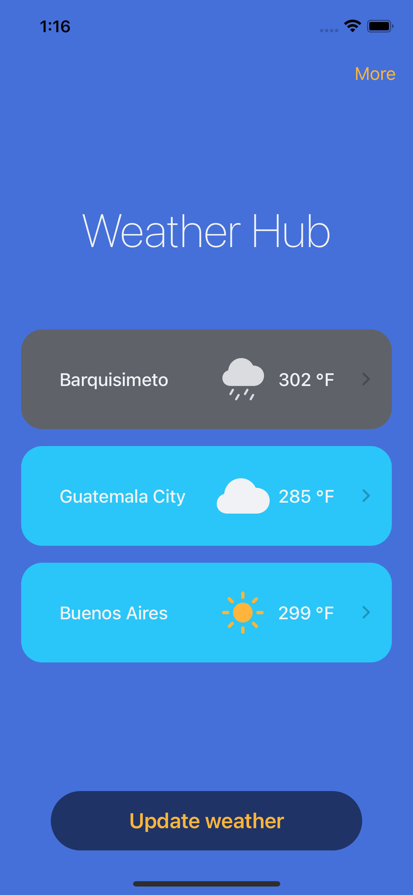
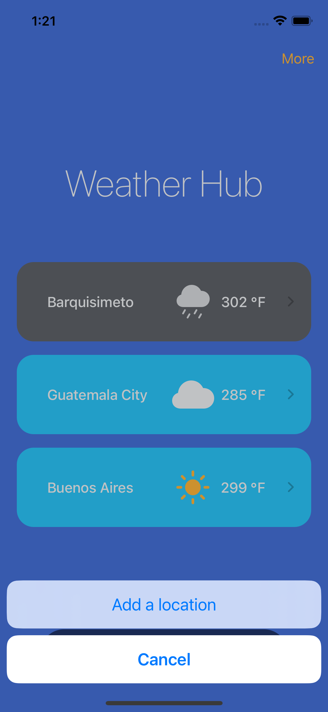
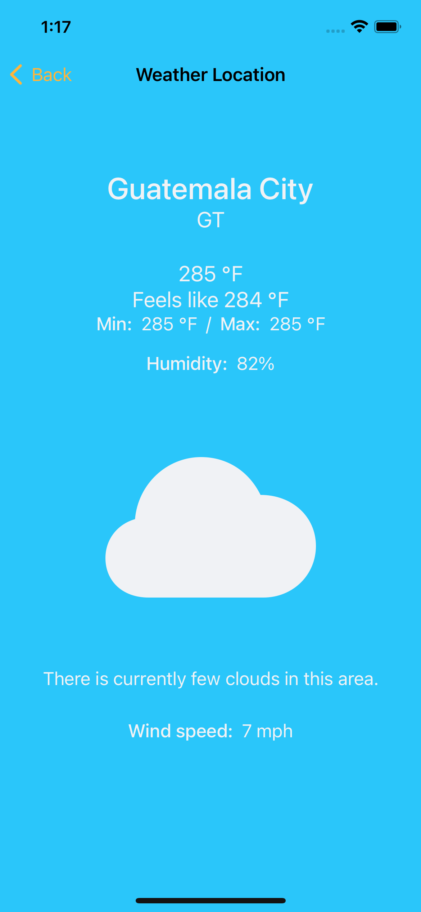

#  Readme

## Tooling

- Xcode 14.2
- Git (Git flow)

## Setup

Include two `.xcconfig` files in the `Configuration` folder for proper compiling, these files should be named `Debug.xcconfig` and `Release.xcconfig` respectively. Both files must contain this:
```
API_KEY = <some_api_key>
```
Remember to replace placeholders with the required values (including 'greater than' and 'less than' symbols).

## Code

### Patterns

- MVVM

### Frameworks

- SwiftUI
- Combine for network requests and specific events

## Screenshots

| Home      | Home ('More' dialog) | Detail     | Add Location     |
|   :----:  |    :----:            |   :----:   |   :----:         |
|  |  |  |  |
